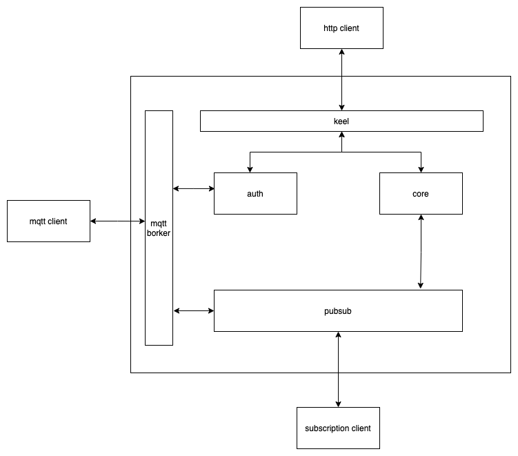
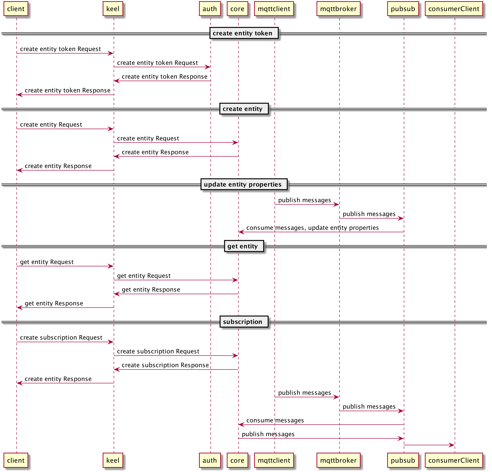

## 🚪 快速入门
Core 是 tKeel 的一个重要基础组件，也拥有单独部署能力，使用相关特性做满足广大用户需求的功能也是我们竭力想要的。

### 安装需要
🔧 在使用 Core 之前请先确保你做足了准备。 
1. [Kubernetes](https://kubernetes.io/)
2. [Dapr with k8s](https://docs.dapr.io/getting-started/)


### 通过 tKeel 安装
Core 作为 tKeel 的基础组件，相关 API 的调用均通过 keel 代理实现。（详细请见[tKeel CLI 安装文档](https://github.com/tkeel-io/cli ))



外部程序可以通过keel代理调用core的API接口，通过设备接入提供的mqtt broker发送数据，从core订阅的数据会写入pubsub，subclient消费pubsub的数据。

keel有两种访问形式。  
#### 外网流量访问

```
KEEL_NODE_PORT=30777 # 如果有更改请查看keel的chart中plugin_components.pluginPort变量
curl http://$NODE_ID:$KEEL_NODE_PORT/$VERSION/$PLUGIN_ID/$METHOD
```
 
#### 内部流量访问
1. 直接访问  
    ```bash
    curl http://keel:$PORT/$VERSION/$PLUGIN_ID/$METHOD
    ```
2. dapr边车访问
    ```bash
    curl http://127.0.0.1:3500/v1.0/invoke/keel/$PLUGIN_ID/$METHOD
    ```
#### 示例
在 tKeel 相关组件安装完成之后，[Python 示例](code/iot-paas.py) 展示了生成 MQTT 使用的 `token`，然后创建实体，上报属性，获取快照，订阅实体的属性等功能。  
为了方便说明，下面是我们使用外部流量方式访问 Keel，和 Python 作为示例语言的代码。我们需要keel和mqtt broker的服务端口用于演示。



##### 获取服务端口
1. Keel 服务端口
```bash
$ KEEL_PORT=$(kubectl get -o jsonpath="{.spec.ports[0].nodePort}" services keel)
```
2. MQTT Server 服务端口
```bash
$ MQTT_PORT=$(kubectl get -o jsonpath="{.spec.ports[0].nodePort}" services emqx)
```

keel openapi 服务地址为k8s ip:keel暴露的nodeport端口
```python
// Source: examples/iot-paas.py
keel_url = "http://{host}:{port}/v0.1.0"
```

##### 创建 token
```python
// Source: examples/iot-paas.py
def create_entity_token(entity_id, entity_type, user_id):
    data = dict(entity_id=entity_id, entity_type=entity_type, user_id=user_id)
    token_create = "/auth/token/create"
    res = requests.post(keel_url + token_create, json=data)
    return res.json()["data"]["entity_token"]
```

##### 创建实体
```python
// Source: examples/iot-paas.py
def create_entity(entity_id, entity_type, user_id, plugin_id, token):
    query = dict(entity_id=entity_id, entity_type=entity_type, user_id=user_id, source="abc", plugin_id=plugin_id)
    entity_create = "/core/plugins/{plugin_id}/entities?id={entity_id}&type={entity_type}&owner={user_id}&source={source}".format(
        **query)
    data = dict(token=token)
    res = requests.post(keel_url + entity_create, json=data)
    print(res.json())
```

##### 上报实体属性
```python
// Source: examples/iot-paas.py
def on_connect(client, userdata, flags, rc):
    if rc == 0:
        print("Connected to MQTT Broker!")
    else:
        print("Failed to connect, return code %d\n", rc)

client = mqtt_client.Client(entity_id)
client.username_pw_set(username=user_id, password=token)
client.on_connect = on_connect
client.connect(host=broker, port=port)
client.loop_start()
time.sleep(1)
payload = json.dumps(dict(p1=dict(value=random.randint(1, 100), time=int(time.time()))))
client.publish("system/test", payload=payload)
```

##### 获取实体快照
```python
// Source: examples/iot-paas.py
def get_entity(entity_id, entity_type, user_id, plugin_id):
    query = dict(entity_id=entity_id, entity_type=entity_type, user_id=user_id, plugin_id=plugin_id)
    entity_create = "/core/plugins/{plugin_id}/entities/{entity_id}?type={entity_type}&owner={user_id}&source={plugin_id}".format(
        **query)
    res = requests.get(keel_url + entity_create)
    print(res.json()["properties"])

```

##### 订阅实体
运行订阅实体之前，先要创建订阅目的地的pubsub，可以通过运行消费topic的示例yaml创建[消费示例yaml](code/subclient/client.yaml)

```python
// Source: examples/iot-paas.py
def create_subscription(entity_id, entity_type, user_id, plugin_id, subscription_id):
    query = dict(entity_id=entity_id, entity_type=entity_type, user_id=user_id, source="abc", plugin_id=plugin_id, subscription_id=subscription_id)
    entity_create = "/core/plugins/{plugin_id}/subscriptions?id={subscription_id}&type={entity_type}&owner={user_id}&source={source}".format(
        **query)
    data = dict(mode="realtime", source="ignore", filter="insert into abc select " + entity_id + ".p1", target="ignore", topic="abc", pubsub_name="client-pubsub")
    print(data)
    res = requests.post(keel_url + entity_create, json=data)
    print(res.json())
```

##### 消费 topic 数据
消费程序作为一个独立的app消费相关topic数据并展示[消费示例](code/subclient)
```python
// Source: examples/subclient/app.py
import flask
from flask import request, jsonify
from flask_cors import CORS
import json
import sys

app = flask.Flask(__name__)
CORS(app)

@app.route('/dapr/subscribe', methods=['GET'])
def subscribe():
    subscriptions = [{'pubsubname': 'client-pubsub',
                      'topic': 'abc',
                      'route': 'data'}]
    return jsonify(subscriptions)

@app.route('/data', methods=['POST'])
def ds_subscriber():
    print(request.json, flush=True)
    return json.dumps({'success':True}), 200, {'ContentType':'application/json'}
app.run()
```